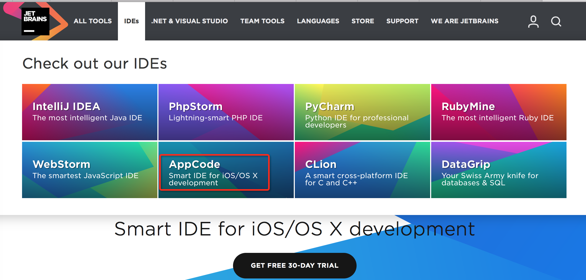
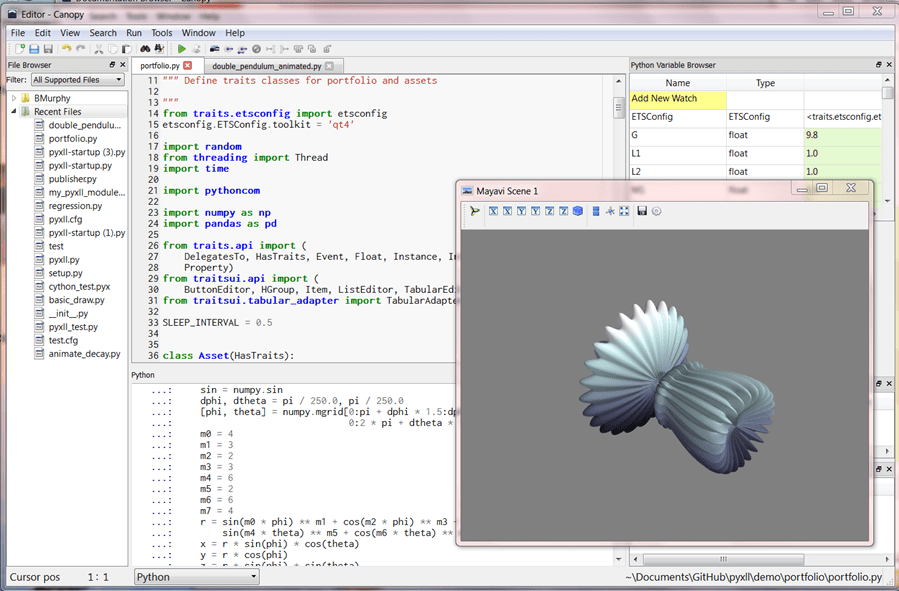

# 常见编辑器和 IDE

下面介绍常见的编辑器和 IDE：

## 编辑器 vs IDE

* 编辑器
  * 跨平台
    * `VSCode`=`VS Code`=`Visual Studio Code`
    * `Sublime`=`Sublime Text`
    * `Atom`
    * `GEdit`
  * Linux类
    * `vi`
      * 增强版：`vim`
    * `Emacs`
    * `GEdit`
  * Mac
    * `文本编辑`
    * `TextMate`
  * Windows
    * `Notepad`
    * `Notepad++`
    * `Notepad2`
    * `EditPlus`
    * `SlickEdit`
    * 专门的：
      * Python
        * `IDLE`
    * `Source Insight`
* IDE
  * 跨平台
    * Eclipse
    * `JetBrains`公司
      * 
      * [IntelliJ IDEA](https://www.jetbrains.com/idea/)：for Java
        * 最大优点：智能提示和自动完成，重构
        * 最大缺点：比较耗资源
      * 其他基于 IDEA 的 IDE
        * JetBrains 公司自己的
          * [AppCode](https://www.jetbrains.com/objc/?fromMenu)：for iOS/macOS
            * Objective-C
            * Swift
            * C/C++
          * [CLion](https://www.jetbrains.com/clion/?fromMenu)：for C and C++
          * [Goland](https://www.jetbrains.com/go/?fromMenu)：for Go
          * [PhpStorm](https://www.jetbrains.com/phpstorm/?fromMenu)：for PHP
          * [PyCharm](https://www.jetbrains.com/pycharm/?fromMenu)：for Python
          * [Rider](https://www.jetbrains.com/rider/?fromMenu)：for .NET
          * [RubyMine](https://www.jetbrains.com/ruby/?fromMenu)：for Ruby
          * [WebStrom](https://www.jetbrains.com/webstorm/?fromMenu)：for Javascript（web 前端）
            * Web 的 Angular/React/Vue.js
            * Mobile 的 Ionic/Cordova/React Native
            * Server 的 Node.js/Meteor
            * Desktop 的 Electron
        * `Google`的：
          * `Android Studio`：for Android
    * [Aptana Studio](http://www.aptana.com/)
  * Mac
    * `Xcode`：for Mac 的所有平台
    * `微信开发者工具`：for 微信小程序
      * 旧称：`微信web开发者工具`
    * `HBuilder`
  * Windows
    * `VS`=`Visual Studio`
      * `C#`

## IDE分类

### 根据语言分

* Python
  * `PyCharm`
  * `Eclipse+PyDev`
  * `Spyder`
  * `PyScripter`
  * `WingIDE`
  * `Enthought Canopy`
    * 简介：面向科学家 和工程师的 Python IDE，它预装了为数据分析而用的库
    * 主页：https://assets.enthought.com/downloads/
    * 截图：
      * 
  * `Komodo`
  * `Eric`
* Java
  * `NetBeans`
  * `JCreator`
* C#
  * `Visual Studio`
* PHP
  * `PhpStorm`
* Android
  * `Android Studio`
* 微信小程序
  * `微信开发者工具`

### 根据主要适用领域

* Web领域
  * Dreamweaver
  * WebStrom
  * Aptana Studio
  * HBuilder
  * Brackets

### 是否支持云端

* 云端IDE = Web端IDE
  * Web版VSCode
  * Gitee IDE
    * 特点
      * 基于微软的 Monaco Editor
  * CodeSandbox
    * 主要用于：Web前端
