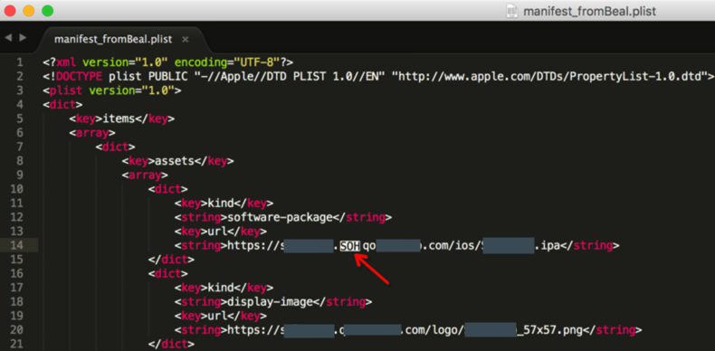
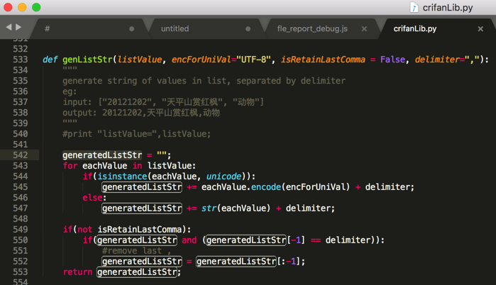
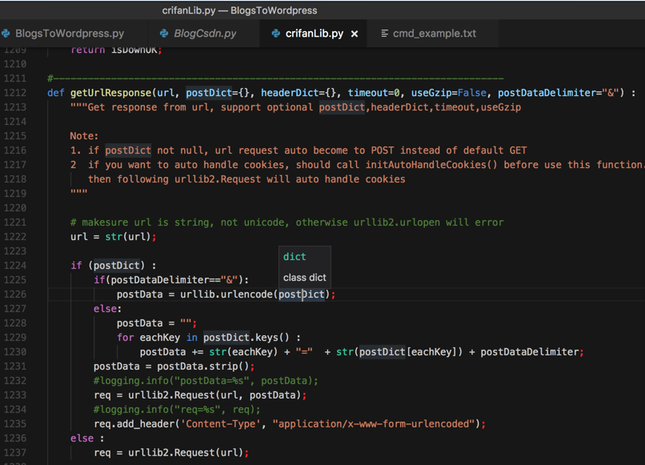
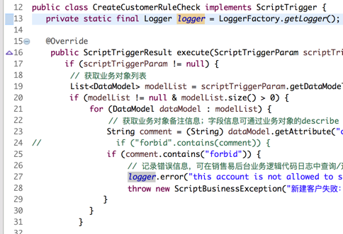
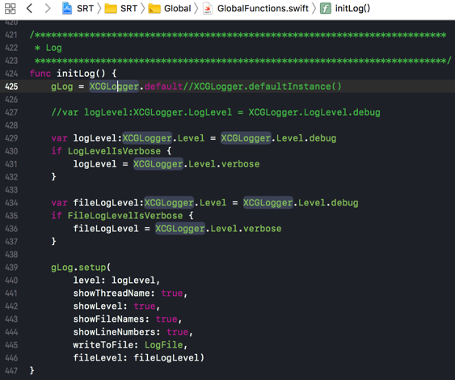
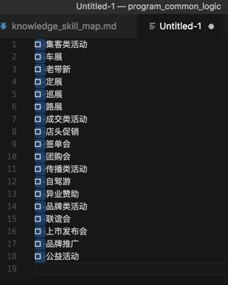
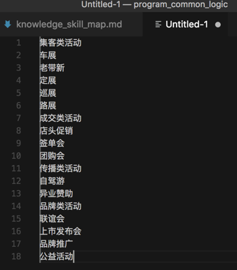
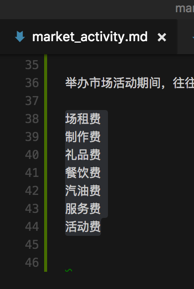
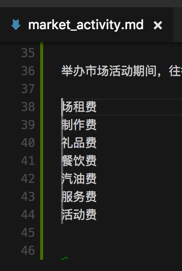
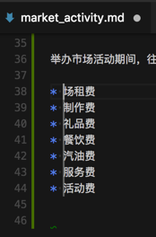

# 通用功能和逻辑

此处整理，编辑器和IDE都通用的功能：

## 支持显示特殊字符包括不可见字符

> #### info:: 字符编码知识
> 关于不可见字符，控制字符，想要深入了解的，可以去看
> 【整理Book】字符编码详解与应用
> 和
> [字符编码简明教程 – 在路上](https://www.crifan.com/character_encoding_charset_simpile_tutorial/)
> 所提到的：
> * ASCII字符集共27个字符 
> * =128个字符 
> * = 33个控制字符 + 95个可见字符
>
> 和
> [字符编码详解](https://www.crifan.com/files/doc/docbook/char_encoding/release/html/char_encoding.html)
> 中的[2.1.2.1. ASCII字符集中的功能/控制字符](https://www.crifan.com/files/doc/docbook/char_encoding/release/html/char_encoding.html#ascii_ctrl_char)

很多编辑器，支持显示特殊字符，比如：

### Notepad++

[Notepad++支持显示回车符，换行符，TAB键，行首，行尾等特殊字符](https://www.crifan.com/files/doc/docbook/rec_soft_npp/release/html/rec_soft_npp.html#npp_func_show_special_char)

### Sublime

举例：

Sublime在需要的时候，能够显示出特殊的SOH字符：

[［已解决］企业版iOS的ipa通过OTA发布后还是无法下载和安装](https://www.crifan.com/enterprise_ios_ipa_ota_release_still_can_not_download_install/)

以协助帮忙找到iOS的OTA版的ipa文件为何无法下载。

### VSCode

详见：

[【已解决】替换掉VSCode中显示出的特殊字符：NAK](http://www.crifan.com/vscode_replace_showing_special_char_nak)

## 选中或光标所在位置的内容的高亮显示

一般的编辑器，IDE都支持常见的：

选中（或者光标所在位置的）一个变量/函数/字符串，则对应的单词会高亮显示

目的是方便及时找到和查看对应的变量/函数等的被使用的地方。

举例：

### Sublime的选中高亮

### VSCode中选中高亮

### Eclipse的选中高亮

### Xcode的选中高亮

## 列编辑模式

有些时候要多列一起编辑，则支持列编辑模式的话，就很好用。

支持列编辑的编辑器或IDE：

* Notepad++
* VSCode

### VSCode支持列编辑

* 批量删除行首的内容
  * Alt+Shift+左键 选择：
    * 
  * 然后删除掉：
    * 
  * 即可批量删除每行前面的多余内容了
* 批量给行首添加内容
  * 想要给每行前面添加星号和空格
    * 先选择要编辑的多行的内容
      * 
    * 鼠标点击到开始位置，然后`Alt+Shift+鼠标左键`选择到所有的行的行首：
      * 
    * 然后直接输入`* `，即可批量添加到每行的行首：
      * 
