# IDE通用功能和逻辑

下面整理IDE的通用逻辑和功能：

## 动态提示=自动完成=代码补全

一般来说，指的是IDE集成的动态提示的功能

当前，现在有些功能强大的编辑器，比如VSCode，也支持部分语言（或库）的动态提示了。

> 注：VSCode中的动态提示，叫做：`IntelliSense`

举例：

### Eclipse的动态补全提示

比如字符串支持哪些c开头的函数或属性：

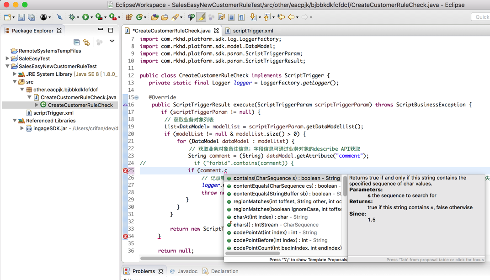

### PyCharm的动态补全提示

比如Selenium的driver有哪些函数或属性：

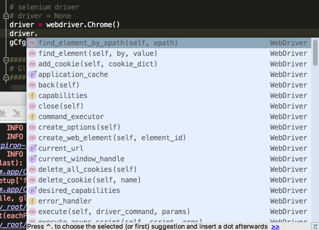

### Xcode的动态补全提示

XCGLogger的log的属性level有哪些

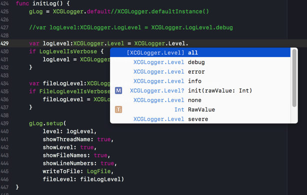

### VSCode的动态补全提示

VSCode，在安装了补全插件后：

代码调试期间，看看python的os模块的有哪些函数：

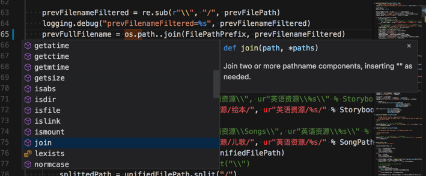

## 焦点提示

在写完代码时，鼠标移动上去还可以看到函数/变量的描述和提示

算是 自动完成的相关功能

### Eclipse的焦点提示

提示Java的string的contains的函数功能说明：

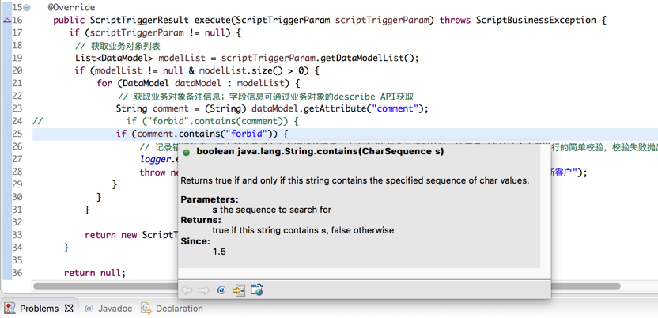

### VSCode的焦点提示

安装了插件的文本编辑器VSCode中也支持提示：函数/变量/库的说明

提示Python的urllib2的功能介绍：

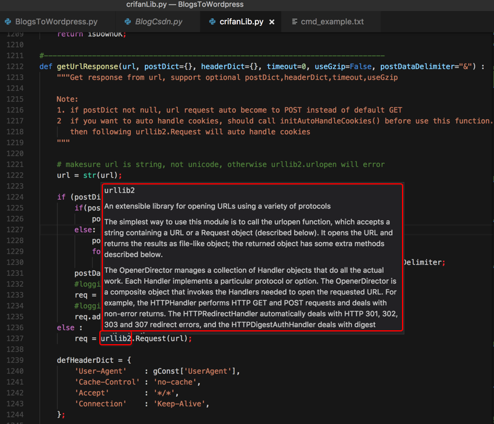

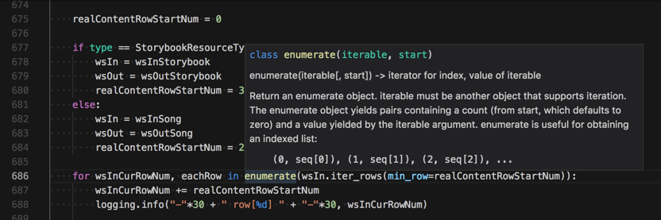

### Xcode的焦点提示

Xcode 9 中需要使用按钮才能看到函数描述

command后，选中：Alt

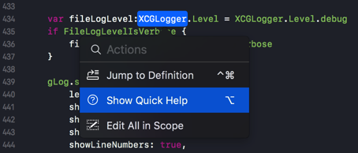

才能看到函数描述：

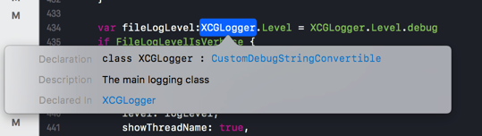

## 智能检测：没有用到的变量的提示警告

对于代码中，定义了却没用到的变量，会智能检测出来并提示

### IDE：Xcode支持

### IDE：PyCharm也支持

比如下图中的cmdPara1，没有被用到：

* 颜色：灰色
  * 而普通代码是黑色
    * 能区分出来
* 鼠标移动上去，会提示
  * 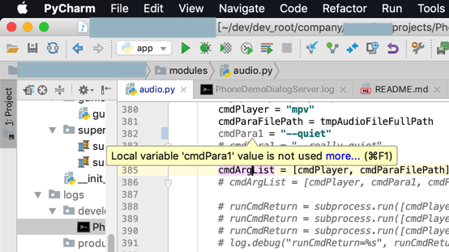

### Editor：VSCode后来也支持

VSCode 1.24之后也支持：

> Unused variable detection - Unused variables are greyed-out in your JavaScript/TypeScript files

## 调试

### 调试时显示的信息

各种IDE，调试期间，所显示的信息，大致都是这几类：

* 变量
  * 局部变量
  * 全局变量
  * 监视的变量
  * 等等
* 断点
  * 查看全部断点
  * 禁止相关断点
  * 等等

### 调试代码的通用逻辑

#### 变量值变化时高亮提示

当你调试代码时，变量值和之前相比有改变时，调试工具会标识出来的：

* 举例
  * VSCode
    * 之前
      * 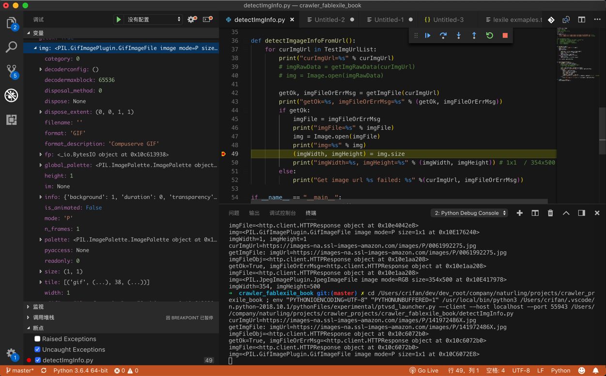
    * 当行运行之后
      * 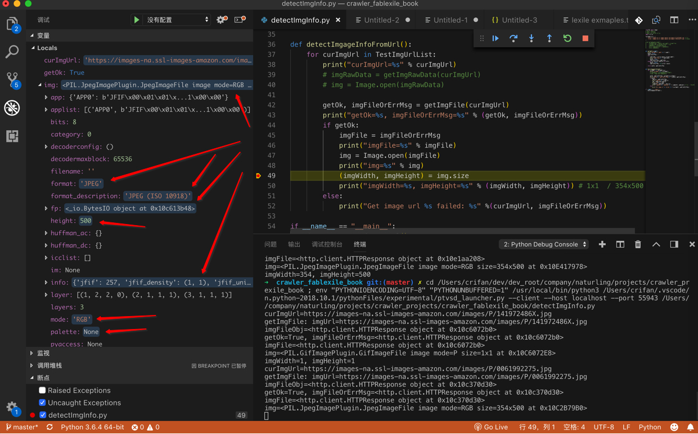
  * PyCharm
    * TODO：
      * 添加例子过来
        * 值的变化是用红色标识的

#### 断点调试

对于断点的逻辑也是通用的：

比如运行到`断点`暂停执行时，点击断点的`调用堆栈`call stack，可以快速定位到代码位置：

* PyCharm调试Python
  * 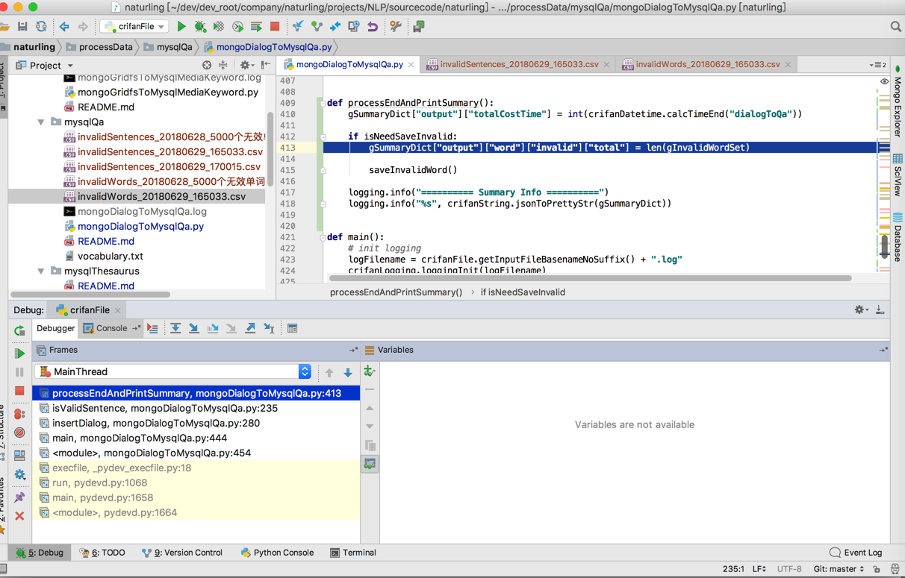
  * 点击后，可以跳转到对应代码的位置
  * 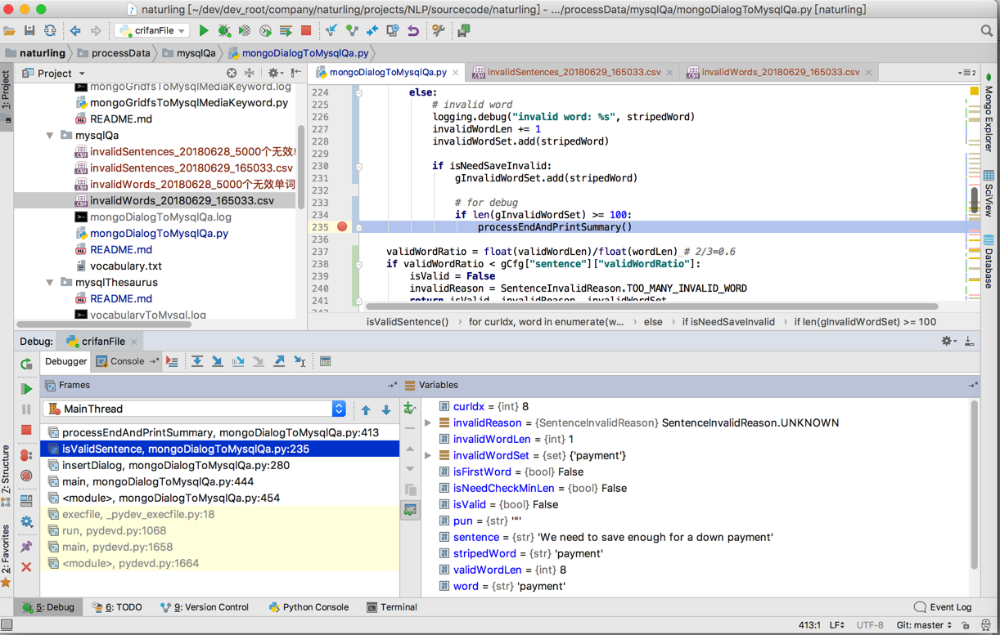

#### 调试异常

调试出错异常时，点击可跳转到出错的代码的位置：

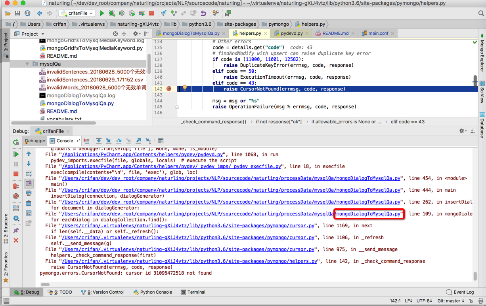

点击对应错误信息中的代码位置，可以跳转到对应源文件：

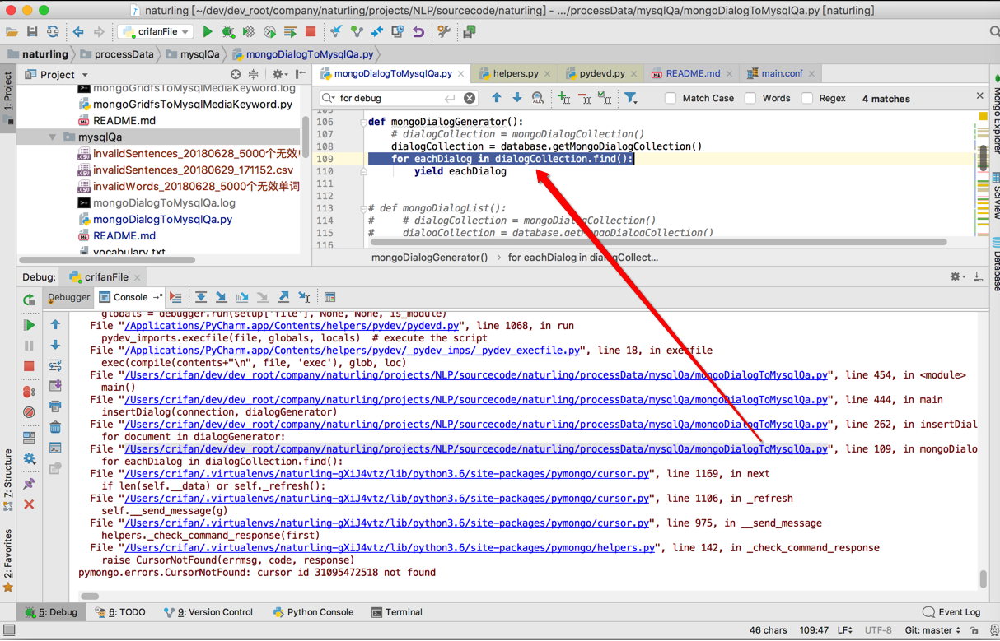

## 编译

IDE中各种界面上功能内部都是对应的调用底层的命令去实现的

比如IDE中的**编译**这个按钮，点击后，内部的过程是：

使用不同的编译器，传递对应的include的头文件、查找库函数的路径、链接对应的库等等，最终去编译生成对应的输出的目标文件的

比如：

[［已解决］Xcode项目编译出错：Command failed due to signal: Segmentation fault: 11](http://www.crifan.com/xcode_compile_command_failed_due_to_signal_segmentation_fault_11)

中而发现：

`Xcode`中底层是用`swiftc`去编译`swift`代码的

> 关于更多的例子，详见：[编译和链接 · 计算机编程通用逻辑知识概念](https://crifan.github.io/program_common_logic/website/computer_program/compile_and_link.html)

## 集成终端Terminal

很多IDE集成了终端

好处是 在用ide开发期间，同时使用终端去做其他方面的测试。

举例：

* `VSCode`写`gitbook`时：用终端去build编译输出为html
* `pycharm`时，调试`crifanLib.py`时：测试提取脚本文件名，用终端测试能否正常解析输入的文件名

## 重构-重命名

对于重构中的变量、函数、类等重命名，在逻辑不复杂，且在当前单一文件内，其实多数编辑器也是支持的。

但其实是很多更加智能的IDE，对于重命名，支持的会更好。

比如：

* PyCharm支持重命名
* 新版Xcode9（+ swift 3.2？／4.0?) 支持swift的重构，包括rename了
  * 之前版本是不支持swift的rename的
