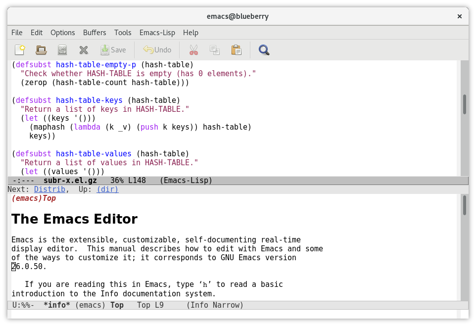

# Emacs

Emacs，作为一个编辑器，历史悠久，也有很多粉丝。

有些高手，可以把Emacs功能扩展强大，甚至成为一个操作系统。

不过我个人基本没用过。

* 截图举例：
  * 
* 想要学习和了解的，可以参考：
  * [一年成为Emacs高手 像神一样使用编辑器](https://github.com/redguardtoo/mastering-emacs-in-one-year-guide/blob/master/guide-zh.org)
