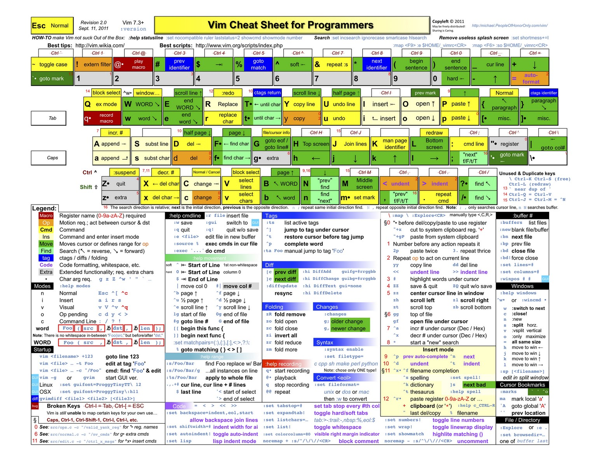

# vi/vim

可以去通过这个游戏：

[PacVim - A CLI Game To Learn Vim Commands - OSTechNix](https://www.ostechnix.com/pacvim-a-cli-game-to-learn-vim-commands/)

去学会常见快捷键操作。

## vi/vim常用快捷键

### vi常用快捷键-键盘图

### vi常用快捷键-表格

| Key | What it does |
| ----| ------------ |
| **Quit related** | |
| `q`   | **q**uit |
| `wq`   | **write** and quit == **save** and quit |
| `q!`   | quit **without save** changes |
| **Move relative to current position** | |
| `h`   | move **left** |
| `j`   | move **down** |
| `k`   | move **up** |
| `l`   | move **right** |
| **Move relative to Word** | |
| `w`   | Move to next **w**ord |
| `W`   | Move to next `blank delimited` **w**ord |
| `b`   | Move to the **b**eginning of the word |
| `B`   | Move to the **b**eginning of `blank delimited` word |
| `e`   | Move to the **e**nd of the word |
| `E`   | Move to the **e**nd of `blank delimited` word |
| **Move relative to Current Line** | |
| `^` | Moves to the `first non-blank character` in the current line |
| `0` or &#124; | Move to the **begining** of the line |
| `$`   | Move to the **end** of the line |
| `+`   | Moves to the first character in the **next** line |
| `-`   | Moves to the first non-blank character in the **previous** line |
| **Move relative to Line of File** | |
| `gg` or `1G` | Move to the **first** line of the file |
| `nG` or `:n` | Move to **n**th line of the file |
| `G` | Move to the **last** line of the file |

> 一些不错的整理：[Vim cheatsheet](https://devhints.io/vim)
