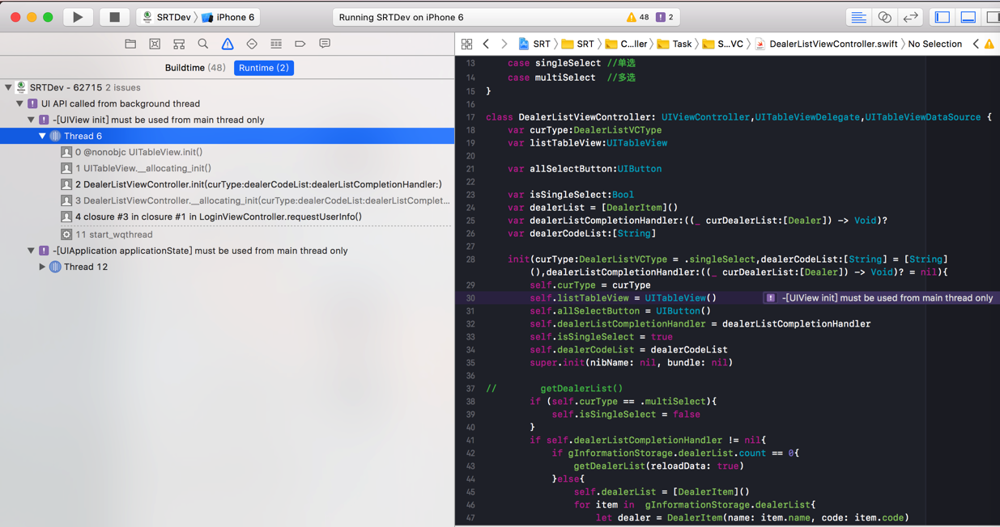
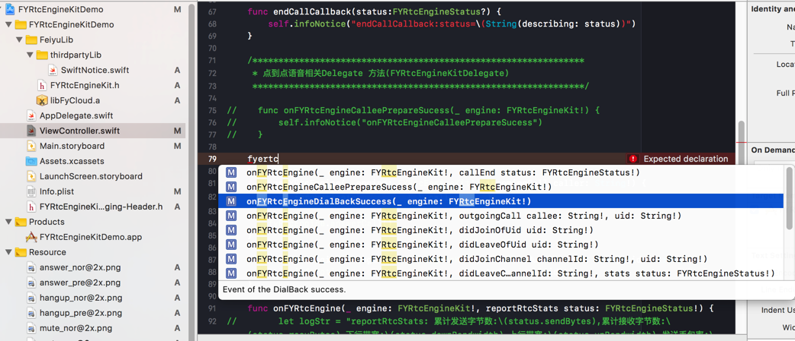
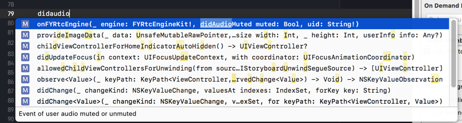
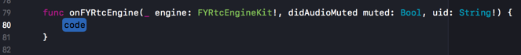

# Xcode

苹果的平台的软件的IDE：`Xcode`

可用来开发苹果旗下的众多平台的软件：

* 桌面端
  * `macOS`
* 移动端
  * `iOS`
  * `watchOS`
  * `tvOS`

## 优点

### 集成了和自己的语言和环境高度整合的功能和智能提示

比如：



此时是当程序崩溃了，提示对应的出错的地方

到底是哪里的代码写错了：把UI相关的内容，放在了非主线程中执行

这样才能帮助我们快速定位问题，改掉错误代码

-> 否则这类`NSInternalInconsistencyException`的问题，需要花费很大精力，并且很难定位到具体错误位置，也就很难解决掉问题的。

Xcode 9 (+ Swift 3.2?) 支持 调试时监测出哪些代码 在后台线程操作主线程=UI线程中的元素了

-》 提示会导致崩溃

-》有些代码并不会立刻崩溃，但是往往后续遇到时，会崩溃

-》而对于这种问题：

在后台线程操作主线程=UI线程中的元素

* 之前版本的Xcode并没有能力监测出来
  * 所以如果需要自己去找，就很麻烦
    * 即使给出了崩溃日志，出错的代码的定位也都很困难
* 同样的有问题的代码，在iOS11之前的，没有崩溃
  * 但是运行到iOS11的机器上，结果就崩溃了
    * 详见：
      * [【已解决】Xcode9编译项目出错：Terminating app due to uncaught exception NSInternalInconsistencyException reason Only run on the main thread](http://www.crifan.com/xcode_9_project_terminating_app_due_to_uncaught_exception_nsinternalinconsistencyexception_reason_only_run_on_the_main_thread)

### 查看到即使没文档的库的有哪些函数

对于集成了的第三方库，即使没有文档，也可以通过Xcode的智能提示，而间接知道有哪些函数

比如：

[【已解决】用飞语FYRtcEngineKit去实现基本的iOS间的语音通话](http://www.crifan.com/use_fyrtcenginekit_to_implement_ios_phone_call_voice_record)

期间，对于飞语的SDK有哪些函数，除了看头文件`FYRtcEngineKit.h`之外，还可以通过，在设置了当前类为代理的前提下，输入对应字符串，而动态提示出对应的函数：



另外，智能提示可以（在.swift代码中）帮助（从OC的函数）自动获得Swift版本的函数：

对于官网和头文件都只提供了OC的库函数，比如：

```swift
- (void)onFYRtcEngine:(FYRtcEngineKit *)engine didAudioMuted:(BOOL)muted Uid:(NSString *)uid;
```

而如何转换为此处希望的Swift的版本，则也可以通过智能提示而自动输入：



回车后即可自动写出函数原型：


